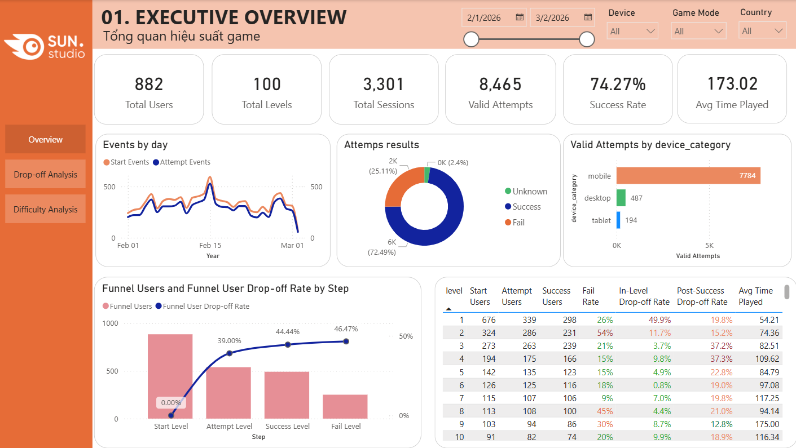

# SunRiser Game Analytics Data Pipeline

## Project Overview

SunRiser is a game analytics data engineering project that transforms raw gameplay event logs into an analytics-ready fact table for Power BI.

The project started from a game analytics case study and was extended into a local batch ETL pipeline with Docker, Airflow orchestration, data quality checks, and Power BI reporting.

## Case Study Objective

The dataset contains player progress events across game levels. The main objective is to analyze the data, identify levels that may have gameplay issues, and design suitable visualizations to monitor those issues.

The case study focuses on:

- Exploring the event-level gameplay data.
- Defining metrics to detect problematic levels.
- Identifying levels with high drop-off or abnormal difficulty.
- Building Power BI visuals to monitor level performance by level, device, country, and game mode.

## Dashboard Overview



## Business Questions

The analysis answers the following questions:

- Which levels have high player drop-off?
- Which levels have unusually low success rate or high fail rate?
- Which levels require many retries or unusually long play time?
- What visualizations can help monitor these level issues?

## Key Findings

The Power BI report focuses on detecting problematic levels rather than proving final root causes.

Main findings:

- **Level 1 has a very high early drop-off rate**, around 49.85%, making onboarding the first area to review.
- **Level 2 shows abnormal difficulty**, with high fail rate and short play time, suggesting players may fail too quickly before understanding the game.
- **Levels 3-4 show post-success drop-off**, meaning some users win but do not continue, which may indicate a weak reward or progression loop.
- **Levels 38-42 and levels after 50 show unstable continuation patterns**, making them good candidates for further review.
- **Levels around 70-94 appear difficult**, with high fail rates compared with earlier levels.

These findings help prioritize which levels should be reviewed by game design or product teams.

## Reports

Analysis artifacts:

```text
reports/pdf/SunRiser_Analysis_Report.pdf
reports/powerbi/Report_SunRiser-Tran Dai Hai.pbix
```

The Power BI report was built from:

```text
powerbi_exports/sunriser_powerbi_fact_events.csv
```

## Current Tech Stack

- Python / pandas
- Apache Airflow
- Docker / Docker Compose
- Power BI
- GitHub

## Current Pipeline Architecture

```text
Raw CSV
  -> Bronze Layer
  -> Silver Layer
  -> Data Quality Check
  -> Power BI fact table
```

## ETL Design

This project is currently a local batch ETL pipeline.

```text
Extract:
Read raw CSV game event logs.

Transform:
Clean and standardize the data with Python, convert timestamps, remove duplicates, and create event flags.

Load:
Export one analytics-ready CSV fact table for Power BI.
```

## Folder Structure

```text
dags/
  sunriser_pipeline_dag.py

data/
  raw/
  bronze/
  silver/

docs/
  architecture.md
  data_dictionary.md
  pipeline_steps.md

reports/
  images/
    dashboard_overview.png
  pdf/
    SunRiser_Analysis_Report.pdf
  powerbi/
    Report_SunRiser-Tran Dai Hai.pbix

src/
  ingest_raw_to_bronze.py
  bronze_to_silver_pandas.py
  validate_silver_quality.py
  silver_to_gold_pandas.py
  run_pipeline.py

powerbi_exports/
  sunriser_powerbi_fact_events.csv
```

> Note: The `data/` and `powerbi_exports/` folders are excluded from version control because they contain raw/intermediate/output data files.

## Pipeline Layers

### Raw Layer

Stores the original source CSV without modification.

### Bronze Layer

Stores ingested raw data with additional ingestion metadata such as ingestion time and source file.

### Silver Layer

Stores cleaned event-level data. This layer standardizes schema, converts timestamps, removes duplicate rows, and creates helper flags.

### Data Quality Layer

Validates the Silver dataset before exporting data to Power BI.

### BI Export Layer

Exports the final analytics-ready fact table:

```text
powerbi_exports/sunriser_powerbi_fact_events.csv
```

This file is imported into Power BI and used to create DAX metrics.

## Airflow DAG

The Airflow DAG contains four main tasks:

```text
ingest_raw_to_bronze
  -> bronze_to_silver
  -> validate_silver_quality
  -> silver_to_powerbi_fact_events
```

## Data Quality Checks

The pipeline validates that:

- The Silver table is not empty.
- Required columns exist.
- `event_name` only contains `level_start` and `level_end`.
- `level` is mostly non-null.
- `event_timestamp` is mostly non-null.
- Flag columns only contain `0` or `1`.
- `level_end` rows have `attempt_flag = 1`.
- `level_start` rows have `attempt_flag = 0`.

## Power BI Metrics Supported

The exported fact table supports DAX metrics such as:

- Total Users
- Level Starts
- Level Ends
- Total Attempts
- Success Rate
- Fail Rate
- Completion Rate
- Drop-off Rate
- Attempts per User
- Average Time Played
- Median Time Played

## How to Run with Docker

Build and run the local pipeline:

```bash
docker compose up --build
```

Expected output:

```text
powerbi_exports/sunriser_powerbi_fact_events.csv
```

## How to Run with Airflow

Start Airflow services:

```bash
docker compose -f docker-compose.airflow.yml up
```

Open Airflow UI:

```text
http://localhost:8080
```

Default login:

```text
username: admin
password: admin
```

Trigger DAG:

```text
sunriser_game_analytics_pipeline
```

## Future Improvements

Planned improvements:

- Add Azure Data Lake Storage Gen2 for cloud storage.
- Add dbt for SQL-based Gold models and documentation.
- Replace pandas transformation with Spark for scalable processing.
- Add Kafka to simulate streaming game telemetry events.
